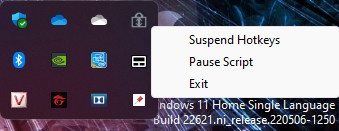

# Always-on-top

*A simple script build from AHK that allow pin any application on top. Support for most windows version.*

## Usage

- Run the .exe file, choose the window that you want to focus, then press CTRL + SPACE.
- To restore to normal, just do it again.

## Change the key combination, icon or application name.

- This is a open-source project, so all you need to do is:
	* Make sure you already have [Auto Hot Key](https://www.autohotkey.com/) installed. 
	* Download (or clone) this repository, then open 'AlwaysOnTop.ahk' in notepad (recommend)
	* Build your app again using (AHK Windows Spy) with your favourite name and icon *(.ico)*
- For lists of key, please check [Key Lists](https://www.autohotkey.com/docs/v1/KeyList.htm) for more infomation.

## Support

- Windows 7, 8, 8.1, 10 and 11
- Windows Vista and XP (Didn't test yet)

 
Make it run at startup?

 

> Open Run dialog (Windows + R)
>
> Type `shell:startup`
>
> A startup folder will open, then copy or move the `.exe` file to there.
>
> 👍 Enjoy! 
>

## Download

